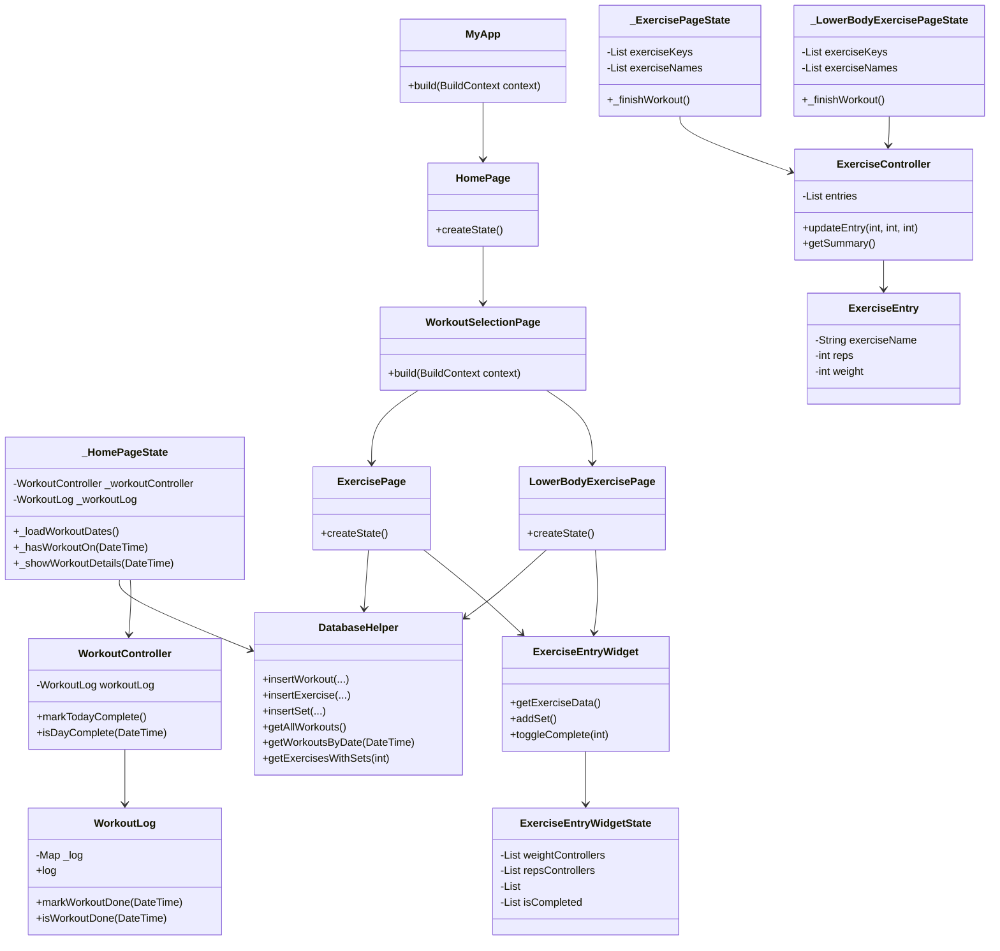

# CS386_final_project

## Introduction

__What does the app do?__

This app is designed to make tracking workouts easier then ever before. Growing up I tracked all my workouts in a big notebook that I carried around. Now this app strives to take its place in an easy to use functional tool to accelerate workout tracking for better workout performance and increased acheivability of personal goals.

__Who is the target user?__

The target user is someone like me, who wants to get in the habit of recording their workout data without it being a pain.

# Design and Architecture

__How the app is structered__

# Instructions

__How to install and run the app__

To install run through the installation process for flutter and dart for vscode. Then download this repository and open it in vscode. In vscode navigate to main.dart and select run. This will build and run the app. To open a phone simulation on your computer, cd to your project folder and type "open -a Simulator" into the terminal. Rerun the app with vscode. You should be able to select the simulator if its not automatically selected.

__How to use key features (add screenshots or GIFs if helpful)__

The home page holds a calendar, the calendar will track your workout history. See workout details by clicking or tapping on a highlighted day. After starting a workout, take notes, give your workout a title, and track your time at the top of the page. Enter reps and weights into the exercise tables below. When your finished, select "Finish" in the top left.

__How do you test it?__

Test it by following the installation process, and then testing any feature listed in the pararaph above.

# Challenges, Role of AI, Insights

__What problems did you face and solve?__

One of my first challenges came during installation, when dependencies like Ruby and others had incompatable versions. The solution was to download Cocoapods through Homebrew, which managed all the versions for me. This made sure that everything was compatible and functioning properly. Another challenge was my limited knowledge of Dart and Flutter. This was solved through hours of online courses and coding side by side with AI to help bridge knowledge gaps.

__How did you use AI?__

I used AI to generate basic code as at first I didn't know a lot about the language. I would then make changes to the code by hand from there. I would repeat this process of AI and handmade changes to help bridge my limited language knowledge. I learned a lot through both my online courses and through using AI, because AI makes mistakes and I was able to learn to solve them, increasing my knowledge.

__What did you learn about GUI design, programming, or tools?__

I learned how important GUI design is. As I went through this process of development, I started to notice how the positioning of elements like buttons or pages, text boxes, etc is so important to a intuitive and efficient design. I also learned the importance of tools like Homebrew, which makes your life easier by automatically managing versions for you. I also learned the difficulties of picking up a new language, but on the flip side, how prior knowledge of other languages benefits your learning process.

# Next Steps

__If you had more time, what would you improve, add, or refactor?__

If I had more time, I would change the track workout button to a swipeable page, so that you could just swipe left to track a workout. I would also connect the previous table column to display your previous workout's reps and weight for easy continous improvement. I would also improve the visual design of the interface.

__Any features you'd like to explore in the future?__

I would like to add features like notifications, customizeable workouts, and a login for multiple user support. 

